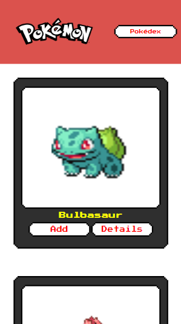
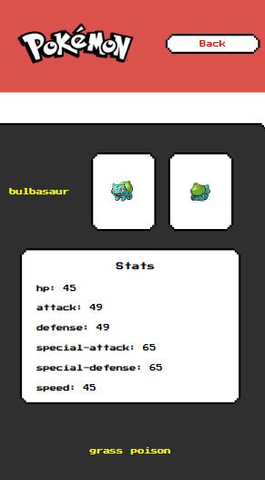
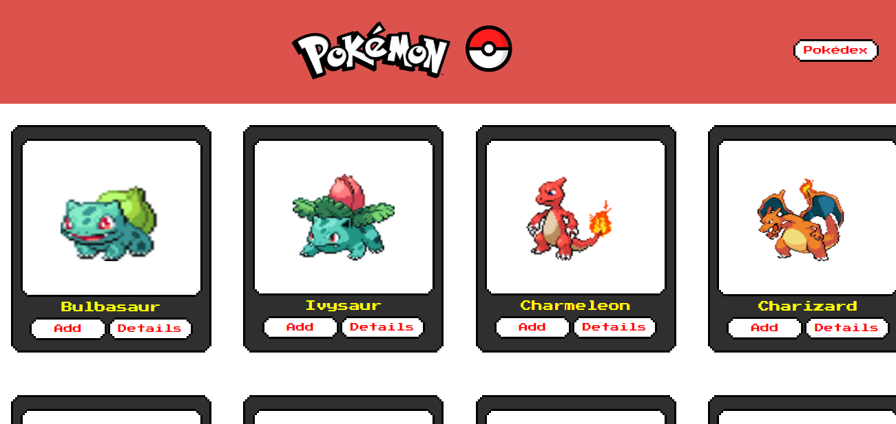
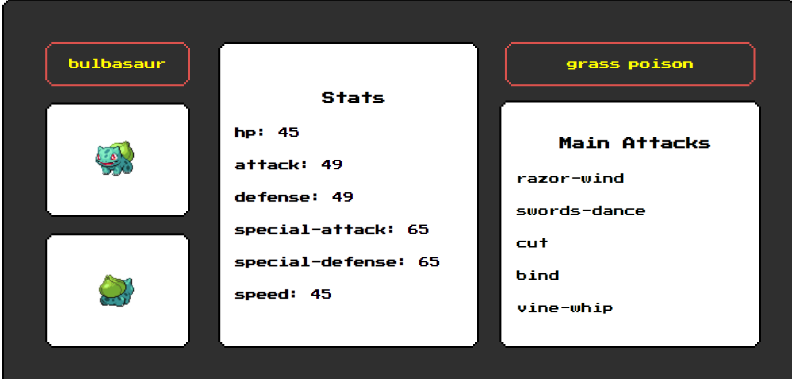

<h1 align="center">
    
</h1>

## 💻 Sobre o projeto
 Pokédex - é um projeto simples e de natureza didática usando a <a href="https://pokeapi.co/">PokéAPI</a> construído durante o bootcamp de Desenvolvimento Front-end com React da <a href="http://www.labenu.com.br/">Labenu</a>.
 
Os usuários têm acesso a uma lista de pokémons, onde podem ver os detalhes de qualquer pokemon e adicionar/remover os pokemons da pokedex.

## 🛠 Tecnologias

<li> React</li>
<li> JavaScript</li>
<li> Styled Components</li>

## 📱 Mobile

  

  

## 🖥 Desktop

  

  

## 📝 Licença

Este projeto esta sobe a licença MIT.

Desenvolvido com  por Jessica Latorre
 👋🏽 (https://www.linkedin.com/in/jessicalatorre182/)

